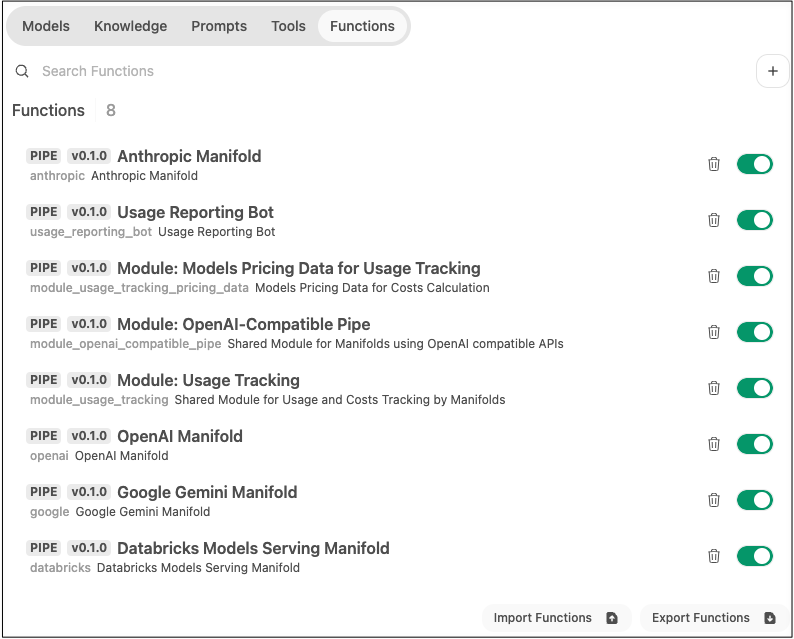
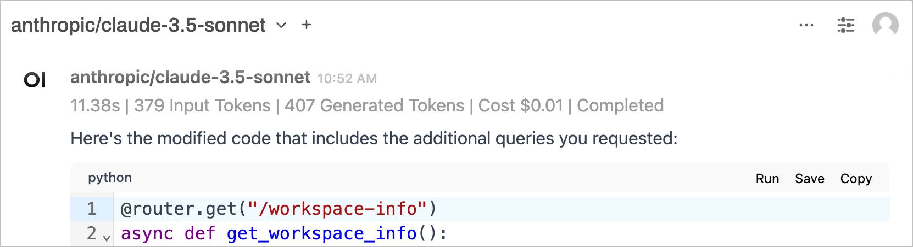
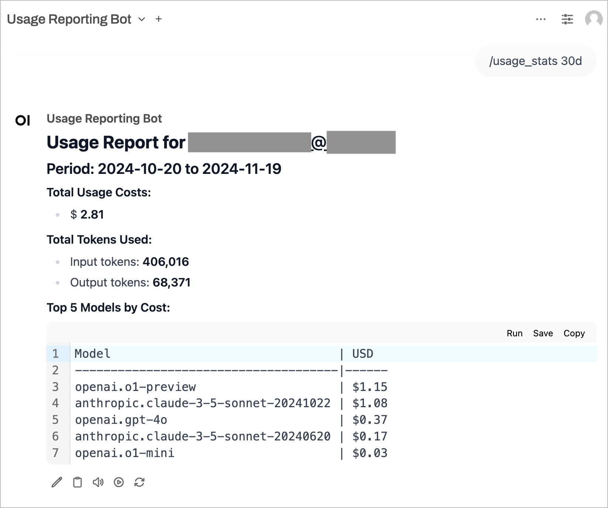
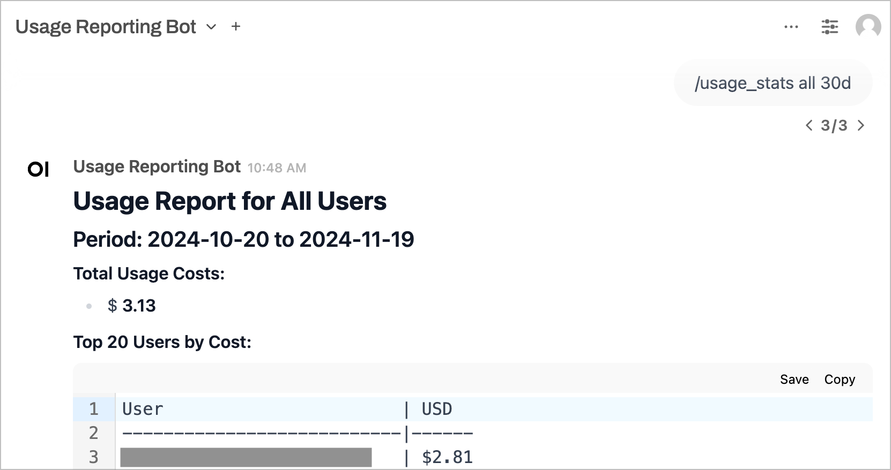

# Cost Tracking Manifold Functions for Open WebUI

## Overview

This repository contains another implementation of manifold functions for OpenWebUI integration with major providers (Anthropic, OpenAI, etc), with usage volumetrics and costs tracking.

To track costs for all providers, you need to DISABLE the OpenWebUI built-in OpenAI integration and only rely on these functions.

While Open WebUI Community has earlier developed a few usage costs tracking Filter functions (example: https://openwebui.com/f/bgeneto/cost_tracker or https://openwebui.com/f/infamystudio/gpt_usage_tracker) they all suffer from common flaws, such as not capturing the usage via APi. OpenWebUI Filter Functions 'outflow' method is only called from the OpenWebUI-specific /chat/completed endpoint, that is only triggered by the Web UI. It is not part of OpenAI-compatible API specs. This method (and therefore any Filter outflow methods) would not be called by any OpenAI-compatible 3rd party tools leveraging OpenWebUI's API.

This implementation fully relies on Pipes (Manifolds) to wrap around the responses streaming and capture usage in a reliable way, so both Web UI and API usage is captured in a similar way. For scalability, usage data is captured to the main database (SQLite or Postgre). For convenient costs retrieval we provide a chatbot interface presenting itself as another model ("Usage Reporting Bot")


## Features

- **Usage and Costs data is logged to DB** a new table usage_costs is created in the main SQLite or Postgres DB
- **Costs tracking works both for UI and API usage** tracking does not depend on /chat/completed calls by the Web UI
- **DRY implementation**: common reusable logic is moved to  "module" functions. <br/>Provider-specific manifold pipe functions depend on these common modules.
- **Calculates usage costs** using pricing data defined in a standalone function module. <br/> Edit it manually as needed if your custom pricing is different from the original providers prices.
- **Emits status event messages** with token counts, estimated costs, request status
- **Built-in reporting on usage costs** by users (their own costs only) and administrators (costs for all users).<br/>Talk with the 'Usage Reporting Bot' model if that pipe function is deployed and enabled

## Requirements

- Python 3.11+
- OpenWebUI v0.4.0+

## Installation (Manual)

- In Open WebUI, manually create functions with IDs matching the .py file names from this repo (src/functions). You may reference the screenshot below. <br/>Сopy&Paste the code of each function from the Python scripts in this repo.

- Prefer short IDs for provider manifold funtions (```openai```, ```anthropic```, ```google```, etc). These IDs will become a part of the Model ID (ex: openai.gpt-4o-mini) and will be visible throughout the system such as over API, in Usage_Costs table and costs reporting, etc.

- **All "module_*" functions must to be deployed**, and the ID must match the .py file name precisely (ex: ```module_openai_compatible_pipe```). 
Other pipe functions in this repo are referencing these shared modules by their ID (hardcoded), so all modules must be deployed with an exact ID.

- Provider-specific functions (openai, anthropic, google, databricks, etc.) are at your discretion - you may only deploy those that you need

- Double-check function IDs before saving! Any time you typed or changed the function name (when creating it for the first time), OpenWebUI automatically adjusts the ID. Make sure to fix the ID before saving the function. If you saved the function with a wrong ID, or if you are getting "function_module_... not found" error, recreate the module function with the correct ID.

- Do not forget to also deploy the ``src/functionsdata/module_usage_tracking_pricing_data.py`` as one more function with  "``module_usage_tracking_pricing_data``" ID.

- The "Usage Reporting Bot" function is optional, but it provides convenient access to users and administrators to view their accumulated usage costs. You may want to deploy it. 

- Enable all deployed functions, and configure Valves to provide API keys where applicable 

- **Additional Recommendation**: improve Model Definitions using Admin Settings -> Models section

  - Visibility (Public or Private restricted to a Group)
  - Upload logo avatar images
  - Provide Descriptions
  - Provide System Prompt
  - For Usage Reporting Bot, configure a description and Custom Prompts example (/help and /usage_costs 30d)
  - For Usage Reporting Bot

## Installation (Scripted)

**1. Clone the repo locally**

**2. (Optional) Activate virtual pyenv**

**3. Install dependencies:**
   ```
   pip install -r requirements.txt
   ```

**4. Create `.env` file with connection detials**

   ```python
   #Your OpenWebUI URL, e.g. http://localhost:3000
   OPENWEBUI_API_URL=http:// 

   #Get your API key in OpenWebUI User Settings -> Account -> API Keys
   OPENWEBUI_API_KEY=sk-....  
   ```

   **NOTE:** If API Key Authentication in your Open-WebUI instance is disabled or restricted by endpoints, you can use JWT Token instead (just use the token value as OPENWEBUI_API_KEY). You can obtain your current JWT token from the Browser's Developer Tools after logging into Open WebUI.  Application -> Cookies -> (your Open WebUI URL) -> "token" cookie value
   
**5. Deploy pipe functions and modules to OpenWebUI (except Pricing Data):**

   ```bash
   python deploy_to_openwebui.py src/functions/*
   ```
**6. Separately deploy one more function (Pricing Data module):**

   ```bash
   python deploy_to_openwebui.py src/functions/pricing-data-module/module_usage_tracking_pricing_data.py
   ```

**7. In OpenWebUI Enable all functions and configure Valves**
   
   Provide API keys where applicable
   
   For OpenAI also provide comma-separated list of enabled models


## **Expected Result (Screenshots)**

### All Funnctions Deployed

   

### Interactive Status Bar displays token counts and costs for each request

   

### Usage Reporting Bot

   
   Usages stats for yourself (regular users)

   
   Usages stats for all users (available to admins only)
